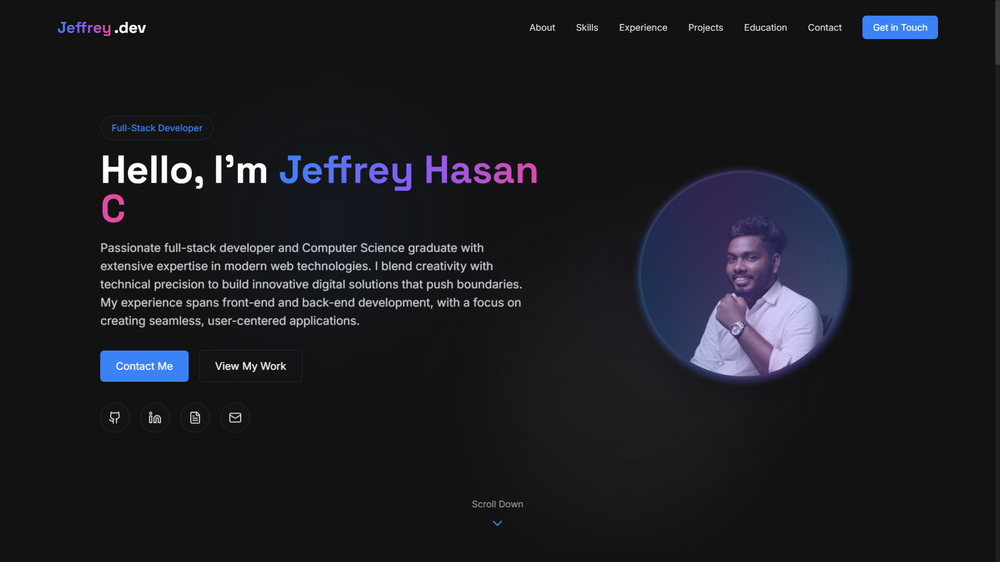

# Jeffrey.dev



**Jeffrey Hasan C’s personal portfolio, showcasing full-stack innovation with modern web technologies.**

---

## About

This is my personal portfolio, highlighting my journey as a full-stack developer. It features a collection of projects built with cutting-edge tools, reflecting my skills in web development and passion for innovation.

**[GitHub](https://github.com/jeffreyhasan10/jeffrey.dev)**

---

## Tech Stack

- **Front-End:** Next.js, React, Tailwind CSS, TypeScript
- **Back-End:** Supabase, Node.js
- **Other:** Three.js, Python, IoT

---

## Setup

1. Clone the repo:  
   ```bash
   git clone https://github.com/jeffreyhasan10/jeffrey.dev.git
   ```
2. Install dependencies:  
   ```bash
   npm install
   ```
3. Run locally:  
   ```bash
   npm run dev
   ```

---

## Contact

- **Email:** [jefyjery10@gmail.com](mailto:jefyjery10@gmail.com)
- **LinkedIn:** [linkedin.com/in/jeffreyhasan](https://linkedin.com/in/jeffreyhasan)
- **GitHub:** [github.com/jeffreyhasan10](https://github.com/jeffreyhasan10)
- **Medium:** [medium.com/@jefyjery10](https://medium.com/@jefyjery10)

---

*Built by Jeffrey Hasan C, March 2025.*
